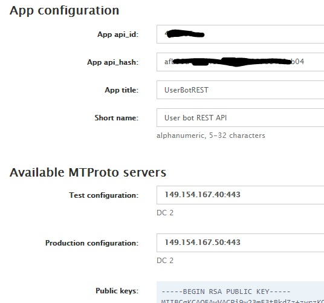
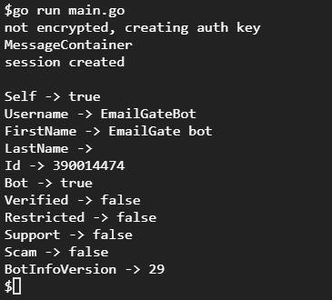

# Example of using Mtproto for Telegram bot

Mtproto lib can be used with Telegram bot, that can acess to full Telegram API, not just the simplified Telegram Bot API.

First, we need get register our bot via Telegram [@BotFather](https://t.me/BotFather) and obtain *bot token* and *bot username*.


Next we [register our app in Telegram](https://my.telegram.org/apps) and obtain

- ApiID
- ApiHash
- IP addresses of MTProto servers
- Public keys



Save text from "Public keys" field to the `keys.pem` file.

Other credentials put to `const` section of `main.go` file.

```go
const (
	// from https://my.telegram.org/apps
	TgAppID       = XXXXX                // integer value from "App api_id" field
	TgAppHash     = "XXXXXXXXXXXX"       // string value from "App api_hash" field
	TgTestServer  = "149.154.167.40:443" // string value from "Test configuration" field
	TgProdServer  = "149.154.167.50:443" // string value from "Production configuration" field

	// from https://t.me/BotFather
	TgBotToken    = "XXXXX"  // bot token from BotFather
	TgBotUserName = "YourBotUserName" // username of the bot
)
```

Then run:

```
go run main.go
```

For my bot I have next output:


